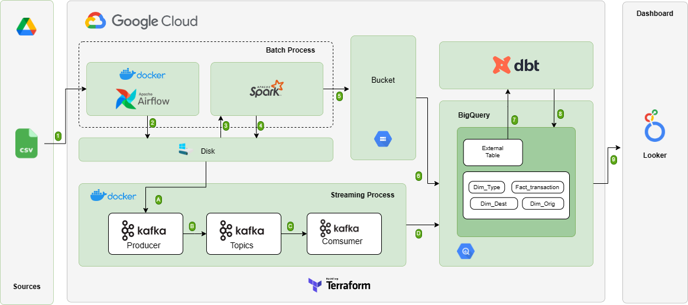
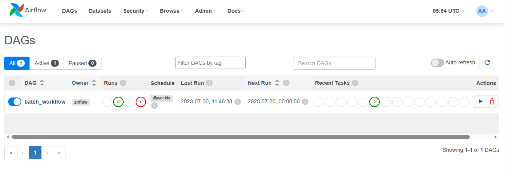
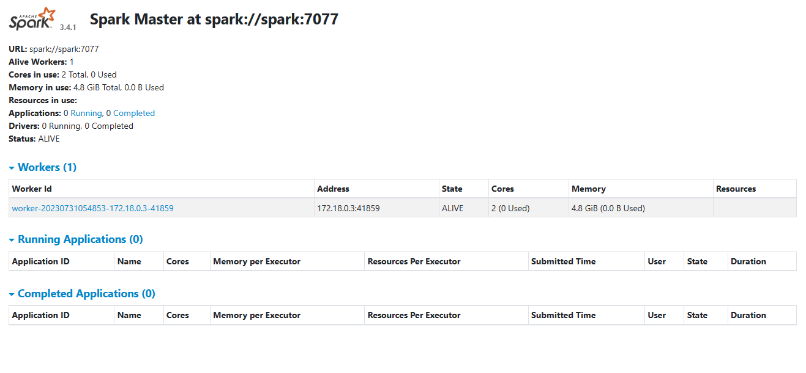
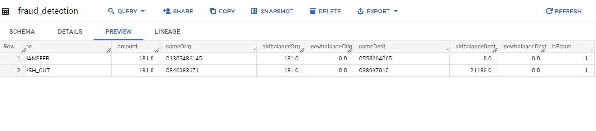
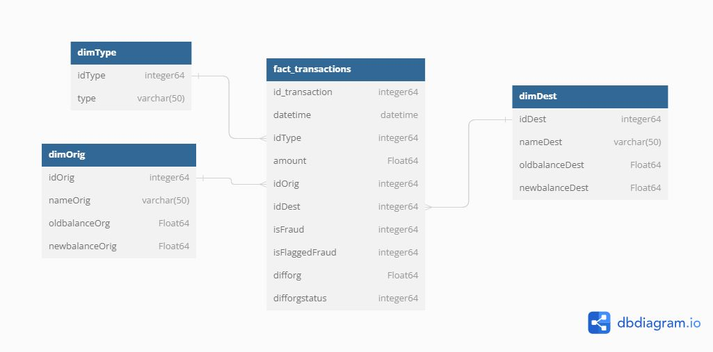
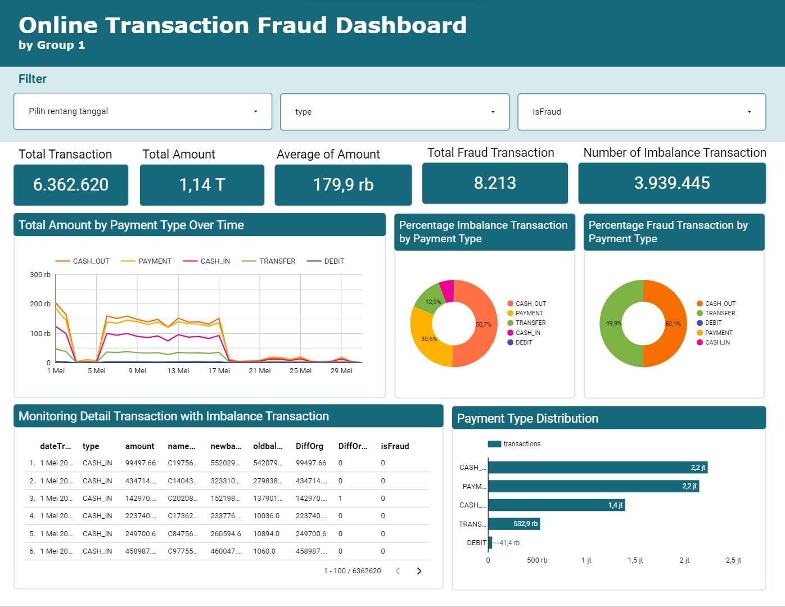
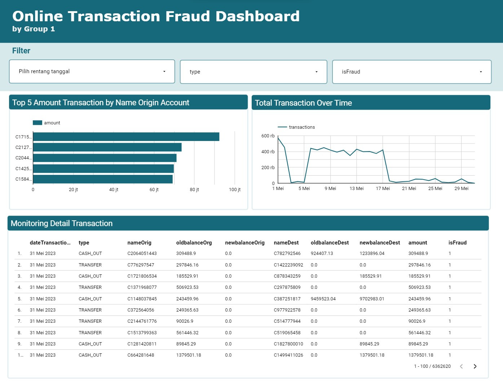

# Fraud Transaction Data Pipeline

An end-to-end data engineering project for online payment fraud analytics. The pipeline supports both batch and streaming ingestion, transforms transaction data, loads curated tables into BigQuery, and exposes the output through Looker Studio dashboards.

## Links

- Dataset: [Google Drive](https://drive.google.com/file/d/1LmPGE7Vgn1yYszM0s9nwfmwr36RHI3BB/view?usp=drive_link)
- Presentation deck: [Canva](https://www.canva.com/design/DAFp8g3_K-M/4F6yNiyhJDTIdD6i_OhaVA/view?utm_content=DAFp8g3_K-M&utm_campaign=designshare&utm_medium=link&utm_source=publishsharelink)
- Dashboard: [Looker Studio](https://lookerstudio.google.com/reporting/eef88548-5ad4-4b22-82c4-37b7bb29ce0e)

## Business Context

Digital wallet providers process a large volume of transactions and need reliable data pipelines for fraud monitoring, reporting, and data quality checks. This project builds a local development pipeline that moves raw online payment data into cloud storage and BigQuery, then creates analytics-ready warehouse and mart tables.

## Objectives

- Build an automated batch pipeline from raw CSV data to transformed BigQuery warehouse tables.
- Build a streaming pipeline that publishes payment events to Kafka and writes them to BigQuery.
- Store fraudulent transactions separately and send an email alert when fraud is detected.
- Model the warehouse with dbt so reporting tables are reproducible.
- Visualize fraud patterns and transaction metrics in Looker Studio.

## Architecture



## Tech Stack

| Layer | Tools |
| --- | --- |
| Orchestration | Apache Airflow |
| Batch transformation | PySpark |
| Streaming | Kafka, Confluent Schema Registry, Avro |
| Data warehouse modeling | dbt |
| Cloud storage | Google Cloud Storage |
| Data warehouse | BigQuery |
| Infrastructure | Terraform |
| Visualization | Looker Studio |
| Local runtime | Docker, Docker Compose |

## Repository Structure

```text
.
|-- dags/                  # Airflow DAG and dataset download script
|-- dbt/                   # dbt BigQuery models, macros, and profiles
|-- images/                # README and dashboard screenshots
|-- kafka/                 # Kafka producer, consumer, schemas, and Compose file
|-- notebook/              # Exploration and preprocessing notebooks
|-- spark/                 # PySpark batch transformation job
|-- terraform/             # GCS and BigQuery infrastructure
|-- .env.example           # Root environment template
|-- docker-compose.yml     # Airflow, Postgres, and Spark services
|-- Dockerfile             # Custom Airflow image with Java, PySpark, and dbt
`-- readme.md
```

Create these local-only folders before running the pipeline:

```bash
mkdir datasets logs service-account
```

## Prerequisites

- Docker Engine and Docker Compose
- Python 3.8+ for running the Kafka producer and consumer locally
- Terraform CLI, only if provisioning GCP resources from this repository
- A GCP project with billing enabled
- A GCP service account key saved as `service-account/service-account.json`

The service account needs access to Google Cloud Storage and BigQuery. For a learning project, the Editor role works, but narrower production permissions are recommended.

## Configuration

Copy the root environment template:

```bash
cp .env.example .env
```

Update `.env`:

```env
AIRFLOW_UID=50000
GCP_PROJECT_ID=your-gcp-project-id
GCP_GCS_BUCKET=your-unique-gcs-bucket-name
```

The bucket name must be globally unique across GCP. The same project ID is used by Docker Compose and dbt through `GCP_PROJECT_ID`.

For streaming email alerts, copy the Kafka environment template:

```bash
cd kafka
cp env.example .env
```

Update `kafka/.env`:

```env
SENDER_EMAIL=your-sender-email@gmail.com
SENDER_PASSWORD=your-gmail-app-password
RECEIVER_EMAIL=fraud-alert-recipient@example.com
PAYMENT_DATASET_PATH=../datasets/PS_20174392719_1491204439457_log.csv
```

Use a Gmail app password instead of your normal Gmail account password.

## Provision GCP Resources

Terraform creates:

- GCS bucket for the data lake
- BigQuery dataset `onlinetransaction_wh`
- BigQuery dataset `onlinetransaction_stream`

Run:

```bash
cd terraform
terraform init
terraform apply \
  -var="project_id=your-gcp-project-id" \
  -var="gcs_bucket_name=your-unique-gcs-bucket-name"
```

If you do not use Terraform, create the resources manually in GCP with the same names configured in `.env`.

## Batch Pipeline

Start Airflow, Postgres, and Spark:

```bash
docker-compose up --build
```

Open the Airflow UI:

```text
http://localhost:8080
```

Default credentials:

```text
username: airflow
password: airflow
```

Enable and run the `batch_workflow` DAG. The DAG:

1. Downloads the online transaction dataset.
2. Runs the PySpark transformation in `spark/spark_transform.py`.
3. Uploads the transformed Parquet output to GCS.
4. Creates a BigQuery external table.
5. Runs dbt staging, core, and mart models.
6. Deletes the temporary staging table.

Spark monitoring is available at:

```text
http://localhost:8081
```




## Streaming Pipeline

Start Kafka, Schema Registry, and Control Center:

```bash
cd kafka
docker-compose up
```

Install local Python dependencies:

```bash
pip install -r requirements.txt
```

Run the producer in one terminal:

```bash
python producer.py
```

Run the consumer in another terminal:

```bash
python consumer.py
```

The producer publishes Avro-encoded transaction events to the `online_payment` topic. The consumer writes every transaction to BigQuery table `onlinetransaction_stream.payment`. When `isFraud = 1`, it also writes the row to `onlinetransaction_stream.fraud_detection` and sends an email alert.

Confluent Control Center is available at:

```text
http://localhost:9021
```





## Data Warehouse

The batch pipeline creates a star-schema-style warehouse in BigQuery:

- `dim_type`
- `dim_orig`
- `dim_dest`
- `fact_table`



Additional mart models provide partitioned and clustered views for analysis by transaction date, payment type, fraud status, and origin-balance difference status.

## Dashboard

The final reporting layer is a Looker Studio dashboard for transaction and fraud analysis.




## Troubleshooting

### Schema Registry exits before connecting to Kafka

If Schema Registry logs repeatedly show that no broker was found, wait for Kafka to finish starting and then restart the Kafka Compose stack:

```bash
docker-compose down
docker-compose up
```

On Windows, if local networking/firewall state blocks the containers, restarting IIS from an Administrator terminal may help:

```bash
iisreset
```

### dbt uses the wrong GCP project

Make sure `.env` contains the intended `GCP_PROJECT_ID`, then restart the Airflow containers so the variable is available to dbt.

### GCS bucket creation fails

GCS bucket names are globally unique. Choose a different value for `GCP_GCS_BUCKET` and `terraform -var="gcs_bucket_name=..."`.

## Recent Improvements

- Rewrote the README with clearer setup, configuration, batch, streaming, and troubleshooting instructions.
- Added `.env.example` and `kafka/env.example` templates.
- Made Docker Compose and dbt read the GCP project from `GCP_PROJECT_ID`.
- Made Terraform project, region, and bucket configurable through variables.
- Fixed the Spark transformation script by removing an invalid `datetime` cast and casting destination balance fields.
- Made the Kafka producer dataset path configurable with `PAYMENT_DATASET_PATH`.
- Made email cleanup in the Kafka consumer safer if SMTP connection setup fails.
